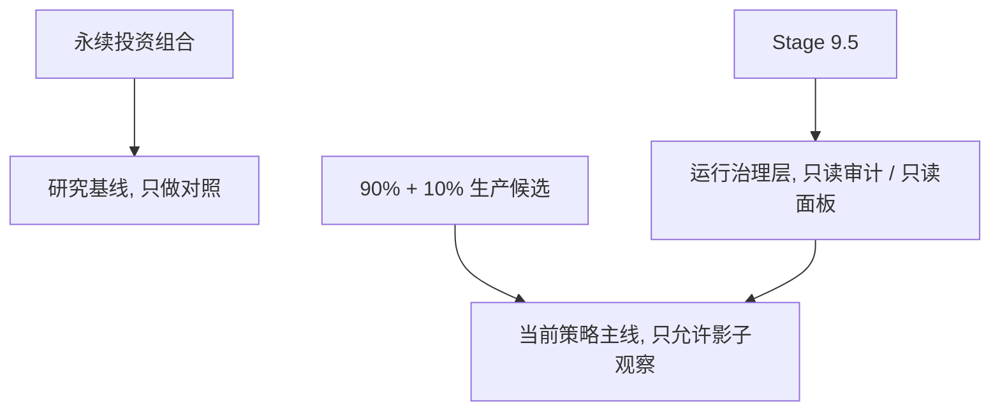

# 息壤 Xi-Rang

> 家族资产的低错误率控制系统。  
> 优先级固定为：`稳定 > 抗通胀 > 收益`。

息壤不是为了追求更刺激的收益，而是为了减少错误、克制交易、长期跑赢通胀。

## 当前状态

当前项目状态：`Research PASS / Production design APPROVED / Live leveraged execution NOT YET APPROVED`

## 招牌指标

当前主线不是单纯的经典永续投资组合，而是：

`90% 防御核心 + 10% 现代贝塔卫星`

也就是 `SPY / TLT / GLD / SHV` 的防御底座，叠加小比例 `QQQ / SPY / GLD` 卫星。Stage 9.5 不是策略本身，而是只读影子观察和风控治理层。

| 口径 | CAGR | MDD | 定位 |
| --- | ---: | ---: | --- |
| `research_current` | `7.60%` | `-13.95%` | 纸面最高研究净值口径，不含真实税务和券商账单 |
| `calibrated_base_case` | `7.03%` | `-14.56%` | 当前最值得参考的真实摩擦校准研究口径 |
| `calibrated_harsh_case` | `6.60%` | `-15.10%` | 校准摩擦下的保守压力口径 |
| 固定防御核心 | `6.27%` | `-11.29%` | 收益不是最高，但回撤最浅，是系统防守锚 |

所以，当前最优解要分两层读：

- 如果问“纸面最高 CAGR / MDD”，答案是 `research_current = 7.60% / -13.95%`。
- 如果问“更接近真实世界、可作为当前主线参考的最优口径”，答案是 `calibrated_base_case = 7.03% / -14.56%`。

`calibrated_base_case` 仍然是研究估算，不是 IBKR 对账单，不是税务意见，不是实盘可得收益，也不代表实盘杠杆获批。当前最终判定仍是：`Research PASS / Production design APPROVED / Live leveraged execution NOT YET APPROVED`。

已经落地：

- `Core / Stability / Alpha` 边界进一步收紧，Alpha 独立账本运行
- 出金坚持“只能申请，不可自动批准/执行”
- `Broker Sync / Shadow Run / 执行前硬闸门 / 执行后对账` 已接入主链路
- `IBKR / Futu / Paper` 三类适配器骨架已具备
- `BrokerExecutor` 已接入最小真实执行骨架
- 真实执行审计流水已落库：`broker_execution_events`
- 首页与只读观察面板已能查看 `Core / Broker Sync / Shadow Run / Stage 9.5`
- 已完成干净数据口径下的 90/10 生产候选审计：`90% 防御核心 + 10% 现代贝塔卫星`
- 已新增 Stage 9.5 影子观察链路：`live.stage95_shadow_runner` 串联 `live.shadow_sync` 与 `live.margin_monitor`，只读 API 与前端面板已接入
- 已完成多策略影子审计平台第一版：策略注册、分层审计结果、multi-strategy shadow runner、只读 API 与前端横向对比面板已端到端接入

## 项目主线

这三层不要混：



- 永续投资组合, 现在是**研究基线**。它负责告诉我们经典永久组合在现代宏观下能走到哪里, 不是当前要跑的主策略。
- `90% 防御核心 + 10% 现代贝塔卫星`, 现在是**生产候选策略**。它是被审计过、允许继续往下走的对象。
- `Stage 9.5`, 不是收益策略, 是**影子观察与风控治理层**。它只负责看 `shadow_sync`、`margin_monitor`、只读 API 和前端是否按红线运行。
- 多策略影子审计平台, 不是新增生产策略, 是 Stage 9.5 的横向观察能力。它让多套候选在同一套只读、fail-closed、真实摩擦与准入门禁下接受比较。

所以现在项目主线不是“继续再造一套新策略”, 而是：

1. 用 Stage 9.5 连续观察当前生产候选。
2. 维持只读、fail closed、不能自动实盘。
3. 只有在人工评审通过后, 才能再谈下一步。

明确不做或暂不推进：

- 自动出金
- 自动主备切换
- 刺激交易冲动的操作台
- 在账本闭环前继续扩收益增强模块
- 直接实盘杠杆执行
- 把 Portfolio Margin 理论安全边界当成券商真实保证

## 它是什么

一个运行在本地或服务器上的 Python 系统，每日收盘后拉取行情，做数据校验、风控判断、调仓决策，并把结果写入账本与审计记录。

系统允许：

- 入金自动入账与分层分配
- Core 的小额、白名单、强约束真实调仓
- 真实账户同步、影子运行、执行后对账

系统不允许：

- 自动出金批准
- 自动出金执行
- Alpha 与主仓混账
- 用模拟利润充当正式收益

## 它不是什么

- 不是高频交易机器人
- 不是追涨杀跌系统
- 不是鼓励频繁交易的前端产品
- 不是“默认打开就自动下单”的实盘工具

更准确地说，它是一个带有最小执行能力的资产控制系统，而不是一个追求交易活跃度的交易产品。

## 当前审计结论

早期引擎口径曾显示 `CAGR 7.65% / MDD -18.12%`，但后续审计发现 AkShare 美股 `qfq` 前复权在长周期分红 ETF 上可能生成负价格，污染回测收益。

当前项目以干净 Yahoo Adj Close 数据为准。2026-06-23 阶段性结论：

- 固定防御核心，50bp 恐慌滑点：约 `CAGR 6.27% / MDD -11.29%`
- 90/10 生产候选聚合：约 `CAGR 7.60% / MDD -13.95%`
- 研究结论：`PASS`
- 生产设计：`APPROVED`
- 实盘杠杆执行：`NOT YET APPROVED`

成本口径：

- 已包含：Yahoo Adj Close 总回报口径、再平衡交易摩擦、动态压力滑点、急性恐慌卖出额外 `50bp` 惩罚。
- 部分包含：卫星 sleeve 年度再平衡成本，按 `FEE_RATE = 0.001` 扣除。
- 未包含：真实税务、非居民股息预扣税、券商现金利息与保证金融资负利差、真实成交队列/盘口冲击、运行失败成本、券商临时提高保证金要求、跨境清算与合规摩擦。

因此 `7.60% / -13.95%` 是**研究净值口径**，不是税后、券商后、故障后的实盘净值口径。任何实盘判断都必须经过 Stage 9.5 影子观察和后续真实摩擦审计。

第一版真实摩擦压力审计结果：

- 无杠杆基础压力：约 `CAGR 5.75% / MDD -15.32%`
- 无杠杆保守压力：约 `CAGR 3.53% / MDD -16.99%`
- `1.15x` 融资参考压力：约 `CAGR 5.90% / MDD -17.94%`

这说明当前 90/10 候选更适合定义为防御底座，而不是已经满足高净后收益目标的完整实盘系统。细节见 [真实摩擦压力审计](D:/codeSpace/BreathofEarth/docs/20-%E7%9C%9F%E5%AE%9E%E6%91%A9%E6%93%A6%E5%8E%8B%E5%8A%9B%E5%AE%A1%E8%AE%A1.md)。

校准摩擦矩阵研究口径：

- `calibrated_base_case`：约 `CAGR 7.03% / MDD -14.56%`
- `calibrated_harsh_case`：约 `CAGR 6.60% / MDD -15.10%`

该校准只用于检验静态年化拖累是否过度扣罚，属于年度假设矩阵下的研究估算。它不是 IBKR 真实对账单，不是税务意见，不是实盘可得收益，也不改变 `Live leveraged execution NOT YET APPROVED`。

Benchmark 对比必须使用双口径：

- 研究口径：`research_current`
- 真实摩擦基础口径：`unlevered_base_case`

当前结论是：真实摩擦口径下，候选系统收益低于 `VBIAX / PRPFX`，但最大回撤显著更浅；在 `RPAR` 的较短历史窗口内，收益与回撤均占优。细节见 [Benchmark 对比审计](D:/codeSpace/BreathofEarth/docs/21-Benchmark%E5%AF%B9%E6%AF%94%E5%AE%A1%E8%AE%A1.md)。

后续若研究如何把真实摩擦口径 CAGR 推向 `7% - 8%`，必须先按 [CAGR 提升研究计划](D:/codeSpace/BreathofEarth/docs/22-CAGR%E6%8F%90%E5%8D%87%E7%A0%94%E7%A9%B6%E8%AE%A1%E5%88%92.md) 走旁路审计。该研究不得直接修改生产候选、不得提高 10% 卫星上限、不得把 Stage 9.5 改成交易执行层。

数据文件治理：

- `data/raw/*.csv` 是可再生成的本地缓存，默认不作为普通 PR 审计输入提交。
- 已批准的研究复现输入放在 `data/audit_snapshots/<date>-<source>/`。
- `data/data_manifest.json` / `data/data_status.json` 记录本地 raw 缓存状态；冻结快照目录必须自带 `manifest.json`，记录行数、日期范围和 SHA256。

最终候选拓扑：

- 90% 防御核心：`SPY / TLT / GLD / SHV`
- 10% 现代贝塔卫星：默认 `QQQ / SPY / GLD`
- 合并权重：`SPY 25.5% / TLT 22.5% / GLD 25.5% / SHV 22.5% / QQQ 4.0%`

当前最重要的命令不是实盘下单，而是影子观察：

```bash
python -m live.stage95_shadow_runner --aum 2000000 --no-broker --skip-db
python -m live.stage95_observation_summary --shadow-dir data/shadow --expected-cycles 60
```

第一条命令会写出 `latest_shadow_sync.json`、`latest_margin_snapshot.json` 与 `latest_stage95_cycle.json`。第二条命令会生成 `latest_stage95_observation_summary.json`，汇总 60 日观察覆盖率、券商不可用次数、滑点和保证金字段覆盖率。`margin_monitor` 在券商不可达或保证金字段缺失时必须返回 `UNAVAILABLE`，不能推导安全结论。

接通真实 IBKR 只读环境前，先跑默认不联网的预检：

```bash
python -m live.ibkr_readonly_preflight
```

只有它返回 `READY_FOR_READONLY_CONNECT`，才允许人工执行：

```bash
python -m live.ibkr_readonly_preflight --connect
```

`--connect` 仍然只创建 `BrokerMode.READ_ONLY` 适配器并调用连接检查，不提交订单、不撤单、不确认交易会话。`FAIL_CLOSED / NOT_READY / ATTENTION` 都必须先排查，不能绕过进入真实券商 Stage 9.5。

Stage 9.5 的 FastAPI 只读接口与前端面板已经接入。`/api/stage95-admission/{portfolio_id}` 会把最新影子账本、保证金快照和 60 日观察汇总合成为生产准入门禁，只返回 `NOT_APPROVED` 或 `READY_FOR_HUMAN_REVIEW`。后者只代表证据链足够进入人工评审，不代表实盘、杠杆或下单获批。缺失、过期、不可解析、券商不可达或保证金字段缺失的报告必须显示为需要关注，不能被渲染成安全状态。该面板不提供交易、加杠杆或 Shadow 转 Live 的入口。

多策略影子审计平台也已经接入只读链路。`/api/multi-strategy-shadow/{portfolio_id}` 会读取 `latest_multi_strategy_shadow.json`，前端在 Stage 9.5 区域展示多策略横向对比，包括策略状态、准入状态、目标权重、滑点状态和保证金快照。该面板只展示后端审计结论，不在前端重新计算准入，不提供交易、加杠杆或 Shadow 转 Live 控件。缺失、过期或不可解析报告必须显示为 `UNAVAILABLE / WARNING / NOT_APPROVED`，不能被渲染成安全状态。

## 运行边界

### 入金

- 可以自动化进入 Stability
- 可在不破坏风险边界时补充 Core

### 出金

- 只能发起请求
- 只能人工审批
- 只能人工执行
- 系统只负责留痕、审批链、审计记录

### Alpha / Lab

- 不是主仓收益增强器
- 是独立实验仓
- 独立资金账本、独立净值、独立审计
- 不进入正式收益汇报

## 券商与执行现状

当前已接入的最小能力：

- `IBKR`
  - 只读同步
  - 对账
  - 最小真实下单 / 查单 / 撤单骨架
- `Futu`
  - 只读同步
  - 对账
  - 最小真实下单 / 查单 / 撤单骨架
- `Paper`
  - 模拟券商接口
  - 用于 Shadow / Sandbox / 回归测试

真实执行不是默认开启的。即使代码已具备能力，也必须先通过 Core 层总闸门、人工批准引用和券商级开关：

- `XIRANG_ENABLE_LIVE_CORE_EXECUTION=1`
- `XIRANG_LIVE_CORE_APPROVAL_ID=<人工批准编号>`
- `IBKR_ENABLE_ORDER_SUBMISSION=1` 或对应券商级提交开关

随后仍必须通过：

- 券商同步覆盖交易日
- 对账不漂移
- 市场与资产白名单
- 订单数 / 换手 / 单笔金额上限
- 执行后对账闭环

## 快速开始

```bash
# 安装依赖
pip install -r requirements.txt

# 运行配置自检与单元测试
python -c "from engine.config import validate_config; validate_config()"
python -m pytest tests -q

# 运行引擎回测
python -m backtest.engine_backtest

# 启动 Web 服务
python -m uvicorn main:app --host 0.0.0.0 --port 8000 --reload
```

首次启动 API 后，需要先创建第一个管理员用户。首次初始化只允许本机请求；如果必须远程初始化，需要先设置一次性环境变量 `XIRANG_INIT_USER_SECRET`，并在请求头带上 `X-Xirang-Init-Secret`。

```bash
curl -X POST http://127.0.0.1:8000/api/admin/init-user \
  -H "Content-Type: application/json" \
  -d '{"username":"admin","password":"请替换为强密码","role":"admin"}'
```

生产环境还应显式设置：

```bash
XIRANG_ENV=production
XIRANG_JWT_SECRET=至少32位的随机密钥
```

每日任务已经接入券商同步硬闸门。空库或未完成券商只读同步/对账时，`daily_runner` 会 fail closed，这是预期行为。

```bash
# 完成只读同步与对账后，再手动运行每日任务
python -m runner.broker_sync --portfolio us
# 手动运行每日任务
python -m runner.daily_runner

# Stage 9.5：生产候选影子观察，不下单
python -m live.stage95_shadow_runner --aum 2000000 --no-broker --skip-db
python -m live.stage95_observation_summary --shadow-dir data/shadow --expected-cycles 60

# IBKR 真实只读环境预检：先静态检查，再人工连接
python -m live.ibkr_readonly_preflight
python -m live.ibkr_readonly_preflight --connect
```

## 常用命令

```bash
python -m runner.daily_runner --force
python -m runner.report
python -m runner.report --days 30
python -m runner.broker_sync --portfolio us
python -m runner.broker_sync --portfolio cn --role backup
python data/daily_fetch.py --no-push
python data/daily_fetch.py --force
```

## 项目结构

```text
BreathofEarth/
├── api/                  # FastAPI 路由与只读 API
├── backtest/             # 回测脚本
├── data/                 # 行情数据与调度
├── db/                   # SQLite 与 schema
├── docs/                 # 项目文档
├── engine/               # 核心引擎、执行层、治理层、Alpha
├── frontend/             # 只读观察面板
├── live/                 # 生产前只读影子同步与保证金监控
├── runner/               # daily_runner / broker_sync / shadow_run / report
├── tests/                # 回归测试
├── CHANGELOG.md
├── DEPLOY.md
├── README.md
└── main.py
```

## 文档入口

- [项目概述](D:/codeSpace/BreathofEarth/docs/01-%E9%A1%B9%E7%9B%AE%E6%A6%82%E8%BF%B0.md)
- [系统设计](D:/codeSpace/BreathofEarth/docs/02-%E7%B3%BB%E7%BB%9F%E8%AE%BE%E8%AE%A1.md)
- [技术方案](D:/codeSpace/BreathofEarth/docs/03-%E6%8A%80%E6%9C%AF%E6%96%B9%E6%A1%88.md)
- [上线前审计清单](D:/codeSpace/BreathofEarth/docs/07-%E4%B8%8A%E7%BA%BF%E5%89%8D%E5%AE%A1%E8%AE%A1%E6%B8%85%E5%8D%95.md)
- [实盘路线图](D:/codeSpace/BreathofEarth/docs/09-%E5%AE%9E%E7%9B%98%E8%B7%AF%E7%BA%BF%E5%9B%BE.md)
- [家族资产稳健化审计](D:/codeSpace/BreathofEarth/docs/12-%E5%AE%B6%E6%97%8F%E8%B5%84%E4%BA%A7%E7%A8%B3%E5%81%A5%E5%8C%96%E5%AE%A1%E8%AE%A1.md)
- [券商接入主备与沙箱实施方案](D:/codeSpace/BreathofEarth/docs/13-%E5%88%B8%E5%95%86%E6%8E%A5%E5%85%A5%E4%B8%BB%E5%A4%87%E4%B8%8E%E6%B2%99%E7%AE%B1%E5%AE%9E%E6%96%BD%E6%96%B9%E6%A1%88.md)
- [家族办公室平台化规划](D:/codeSpace/BreathofEarth/docs/14-%E5%AE%B6%E6%97%8F%E5%8A%9E%E5%85%AC%E5%AE%A4%E5%B9%B3%E5%8F%B0%E5%8C%96%E8%A7%84%E5%88%92.md)
- [生产候选方案与后续开发指南](D:/codeSpace/BreathofEarth/docs/15-%E7%94%9F%E4%BA%A7%E5%80%99%E9%80%89%E6%96%B9%E6%A1%88%E4%B8%8E%E5%90%8E%E7%BB%AD%E5%BC%80%E5%8F%91%E6%8C%87%E5%8D%97.md)
- [Stage 9.5 影子观察运行手册](D:/codeSpace/BreathofEarth/docs/16-Stage9.5%E5%BD%B1%E5%AD%90%E8%A7%82%E5%AF%9F%E8%BF%90%E8%A1%8C%E6%89%8B%E5%86%8C.md)
- [IBKR 只读接入清单](D:/codeSpace/BreathofEarth/docs/19-IBKR%E5%8F%AA%E8%AF%BB%E6%8E%A5%E5%85%A5%E6%B8%85%E5%8D%95.md)
- [真实摩擦压力审计](D:/codeSpace/BreathofEarth/docs/20-%E7%9C%9F%E5%AE%9E%E6%91%A9%E6%93%A6%E5%8E%8B%E5%8A%9B%E5%AE%A1%E8%AE%A1.md)
- [Benchmark 对比审计](D:/codeSpace/BreathofEarth/docs/21-Benchmark%E5%AF%B9%E6%AF%94%E5%AE%A1%E8%AE%A1.md)
- [CAGR 提升研究计划](D:/codeSpace/BreathofEarth/docs/22-CAGR%E6%8F%90%E5%8D%87%E7%A0%94%E7%A9%B6%E8%AE%A1%E5%88%92.md)
- [多策略影子审计平台设计](D:/codeSpace/BreathofEarth/docs/23-%E5%A4%9A%E7%AD%96%E7%95%A5%E5%BD%B1%E5%AD%90%E5%AE%A1%E8%AE%A1%E5%B9%B3%E5%8F%B0%E8%AE%BE%E8%AE%A1.md)
- [Stage 9.5 多策略 Smoke 记录](D:/codeSpace/BreathofEarth/docs/24-Stage9.5%E5%A4%9A%E7%AD%96%E7%95%A5Smoke%E8%AE%B0%E5%BD%95.md)

## 一句话总结

息壤当前最值得信任的地方，不是“它已经能帮你赚很多”，而是“它越来越不容易帮你犯大错”。
